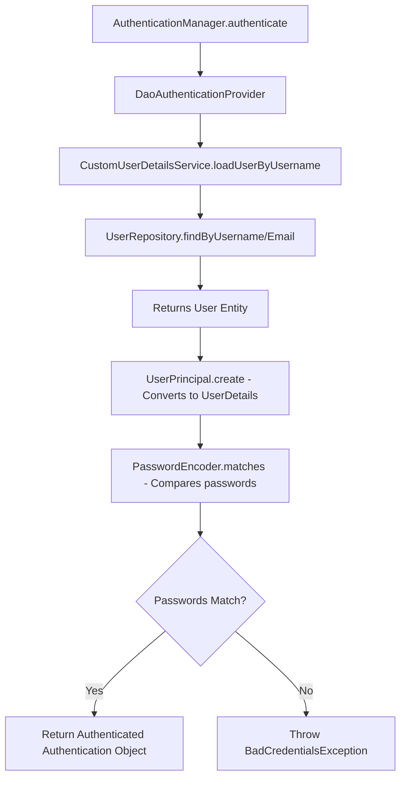
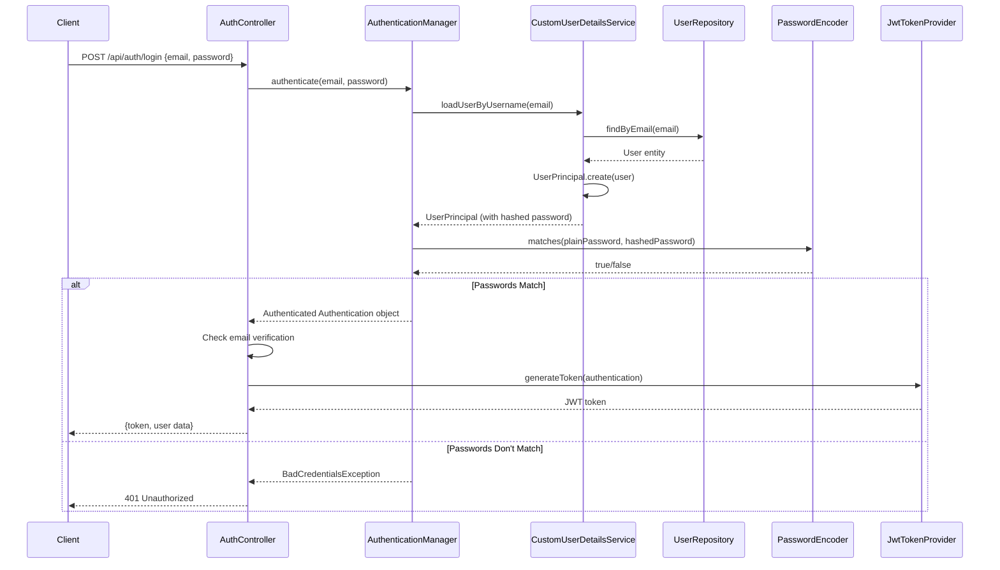

000000000000000# Authentication Flow - Detailed Explanation

## Your Question: Why is AuthService Empty?

You're absolutely right to notice this! The `AuthService` and `AuthServiceImpl` are indeed empty, and that's because **your authentication logic is NOT in a custom service** - instead, it's handled by **Spring Security's built-in authentication mechanism**.

Let me explain exactly how it works:

---

## The Authentication Architecture

### What You See in AuthController

```java
@RestController
@RequestMapping("/api/auth")
@RequiredArgsConstructor
public class AuthController {
    
    private final AuthenticationManager authenticationManager;  // ← Where does this come from?
    private final JwtTokenProvider tokenProvider;
    private final UserService userService;
    
    @PostMapping("/login")
    public ResponseEntity<?> login(@RequestBody LoginRequest loginRequest) {
        // This is the KEY line that does authentication
        Authentication authentication = authenticationManager.authenticate(
                new UsernamePasswordAuthenticationToken(
                        loginIdentifier,
                        loginRequest.getPassword()));
        
        // ... rest of the code
    }
}
```

### The Mystery: Where is AuthenticationManager Defined?

You noticed that `AuthenticationManager` is injected but you can't find where it's implemented. Here's the answer:

**It's defined in `SecurityConfig.java` at line 36-38:**

```java
@Bean
public AuthenticationManager authenticationManager(AuthenticationConfiguration authConfig) throws Exception {
    return authConfig.getAuthenticationManager();
}
```

**What does this mean?**
- `AuthenticationConfiguration` is a Spring Security class that automatically configures authentication
- `authConfig.getAuthenticationManager()` returns Spring Security's default `AuthenticationManager`
- By marking it as `@Bean`, it becomes available for dependency injection
- That's why `AuthController` can inject it via `@RequiredArgsConstructor`

---

## How Authentication Actually Works (Step-by-Step)

Let's trace the complete flow when a user logs in:

### Step 1: User Sends Login Request
```http
POST /api/auth/login
{
  "email": "user@example.com",
  "password": "password123"
}
```

### Step 2: AuthController Receives Request
```java
@PostMapping("/login")
public ResponseEntity<?> login(@RequestBody LoginRequest loginRequest) {
    String loginIdentifier = loginRequest.getEmail();
    
    // Step 3: Create an authentication token (not yet authenticated)
    Authentication authentication = authenticationManager.authenticate(
            new UsernamePasswordAuthenticationToken(
                    loginIdentifier,      // username/email
                    loginRequest.getPassword()));  // password
    
    // ... continues after authentication succeeds
}
```

### Step 3: AuthenticationManager Takes Over

When you call `authenticationManager.authenticate()`, here's what happens **behind the scenes**:



### Step 4: CustomUserDetailsService Loads User

**File: `CustomUserDetailsService.java`**

```java
@Service
@RequiredArgsConstructor
public class CustomUserDetailsService implements UserDetailsService {
    
    private final UserRepository userRepository;
    
    @Override
    @Transactional
    public UserDetails loadUserByUsername(String username) throws UsernameNotFoundException {
        // Spring Security calls this method automatically!
        // Try to find by username first, then by email
        User user = userRepository.findByUsername(username)
                .or(() -> userRepository.findByEmail(username))
                .orElseThrow(() -> new UsernameNotFoundException("User not found: " + username));
        
        // Convert User entity to UserPrincipal (which implements UserDetails)
        return UserPrincipal.create(user);
    }
}
```

**Key Points:**
- Spring Security **automatically calls** `loadUserByUsername()` when authenticating
- You don't call this method directly - Spring does it for you
- This method loads the user from the database
- It converts your `User` entity to `UserPrincipal` (which implements Spring's `UserDetails` interface)

### Step 5: UserPrincipal Wraps User Data

**File: `UserPrincipal.java`**

```java
@Data
@AllArgsConstructor
public class UserPrincipal implements UserDetails {
    
    private UUID id;
    private String username;
    private String email;
    private String password;  // ← This is the HASHED password from database
    private String roleName;
    private boolean isActive;
    
    public static UserPrincipal create(User user) {
        return new UserPrincipal(
                user.getId(),
                user.getUsername(),
                user.getEmail(),
                user.getPassword(),  // ← Hashed password
                user.getRole().getName(),
                true
        );
    }
    
    @Override
    public Collection<? extends GrantedAuthority> getAuthorities() {
        // Converts role name to Spring Security authority
        return Collections.singletonList(new SimpleGrantedAuthority("ROLE_" + roleName));
    }
    
    @Override
    public String getPassword() {
        return password;  // Returns hashed password for comparison
    }
    
    // ... other UserDetails methods
}
```

**Why UserPrincipal?**
- Spring Security needs a `UserDetails` object to work with
- `UserPrincipal` adapts your `User` entity to Spring Security's interface
- It provides the password and authorities (roles) for authentication

### Step 6: Password Comparison

Spring Security automatically compares passwords using `PasswordEncoder`:

**File: `PasswordEncoderConfig.java`**

```java
@Configuration
public class PasswordEncoderConfig {
    
    @Bean
    public PasswordEncoder passwordEncoder() {
        return new BCryptPasswordEncoder();
    }
}
```

**What happens:**
1. User submits plain text password: `"password123"`
2. `CustomUserDetailsService` loads user with hashed password: `"$2a$10$abc123..."`
3. Spring Security calls: `passwordEncoder.matches("password123", "$2a$10$abc123...")`
4. BCrypt hashes the plain password and compares it with the stored hash
5. If they match → authentication succeeds
6. If they don't match → throws `BadCredentialsException`

### Step 7: Back to AuthController

After `authenticationManager.authenticate()` succeeds:

```java
@PostMapping("/login")
public ResponseEntity<?> login(@RequestBody LoginRequest loginRequest) {
    // This line completes successfully if credentials are correct
    Authentication authentication = authenticationManager.authenticate(
            new UsernamePasswordAuthenticationToken(loginIdentifier, loginRequest.getPassword()));
    
    // Now we have an authenticated Authentication object
    UserPrincipal userPrincipal = (UserPrincipal) authentication.getPrincipal();
    User user = userService.getUserById(userPrincipal.getId());
    
    // Check email verification
    if (!user.isAdmin() && !user.isSuperAdmin() && !user.getIsEmailVerified()) {
        // Return error if email not verified
        return ResponseEntity.status(403).body(response);
    }
    
    // Set authentication in security context
    SecurityContextHolder.getContext().setAuthentication(authentication);
    
    // Generate JWT token
    String jwt = tokenProvider.generateToken(authentication);
    
    // Return token and user data
    response.put("token", jwt);
    response.put("user", userData);
    return ResponseEntity.ok(response);
}
```

---

## Complete Authentication Flow Diagram



---

## Why AuthService is Empty (The Answer)

Now you understand why `AuthService` and `AuthServiceImpl` are empty:

### ❌ You DON'T need a custom AuthService because:

1. **Spring Security provides `AuthenticationManager`** - It handles authentication automatically
2. **`CustomUserDetailsService` loads users** - This is your "authentication service"
3. **`PasswordEncoder` compares passwords** - Spring Security handles this
4. **`JwtTokenProvider` generates tokens** - This is your token service
5. **`UserService` handles user operations** - Registration, email verification, password reset

### ✅ The actual authentication components are:

| Component | Location | Purpose |
|-----------|----------|---------|
| `AuthenticationManager` | `SecurityConfig.java` (line 36) | Orchestrates authentication |
| `CustomUserDetailsService` | `security/CustomUserDetailsService.java` | Loads user from database |
| `UserPrincipal` | `security/UserPrincipal.java` | Adapts User to Spring Security |
| `PasswordEncoder` | `PasswordEncoderConfig.java` | Hashes and compares passwords |
| `JwtTokenProvider` | `security/JwtTokenProvider.java` | Generates and validates JWT tokens |
| `UserService` | `service/UserService.java` | User CRUD operations |

---

## How Spring Security Wires Everything Together

Spring Security uses **Dependency Injection** and **Auto-Configuration** to connect all pieces:

### 1. SecurityConfig Creates Beans

```java
@Configuration
@EnableWebSecurity
public class SecurityConfig {
    
    @Bean
    public AuthenticationManager authenticationManager(AuthenticationConfiguration authConfig) {
        return authConfig.getAuthenticationManager();
    }
    
    // This bean is automatically used by AuthenticationManager
    // Spring finds it because CustomUserDetailsService implements UserDetailsService
}
```

### 2. Spring Auto-Detects CustomUserDetailsService

```java
@Service  // ← This makes it a Spring bean
public class CustomUserDetailsService implements UserDetailsService {
    // Spring Security automatically finds this and uses it for authentication
}
```

### 3. Spring Auto-Detects PasswordEncoder

```java
@Bean  // ← This makes it available for injection
public PasswordEncoder passwordEncoder() {
    return new BCryptPasswordEncoder();
}
```

### 4. AuthenticationManager Uses Them Automatically

When you call `authenticationManager.authenticate()`, Spring Security:
1. Finds `CustomUserDetailsService` (because it implements `UserDetailsService`)
2. Calls `loadUserByUsername()` to get user details
3. Finds `PasswordEncoder` bean
4. Uses it to compare passwords
5. Returns authenticated `Authentication` object if successful

**You don't need to wire these together manually - Spring does it automatically!**

---

## What Each File Does (Summary)

### Configuration Files

**`SecurityConfig.java`**
- Creates `AuthenticationManager` bean (line 36-38)
- Configures security rules (which endpoints are public/protected)
- Adds JWT filter to filter chain
- Configures OAuth2 login

**`PasswordEncoderConfig.java`**
- Creates `PasswordEncoder` bean (BCrypt)
- Used for hashing passwords during registration
- Used for comparing passwords during login

### Security Files

**`CustomUserDetailsService.java`**
- Implements `UserDetailsService` interface
- Loads user from database by username/email
- Converts `User` entity to `UserPrincipal`
- **This is the core of authentication!**

**`UserPrincipal.java`**
- Implements `UserDetails` interface
- Wraps your `User` entity for Spring Security
- Provides password and authorities (roles)

**`JwtTokenProvider.java`**
- Generates JWT tokens after successful authentication
- Validates JWT tokens for protected endpoints
- Extracts user info from tokens

**`JwtAuthenticationFilter.java`**
- Intercepts every request
- Checks for JWT token in `Authorization` header
- Validates token and sets authentication in security context

### Controller Files

**`AuthController.java`**
- Handles HTTP requests for authentication
- Uses `AuthenticationManager` to authenticate users
- Uses `JwtTokenProvider` to generate tokens
- Uses `UserService` for registration and email verification

### Service Files

**`UserService.java` / `UserServiceImpl.java`**
- User CRUD operations (create, read, update, delete)
- Email verification logic
- Password reset logic
- **NOT used for authentication** (that's `CustomUserDetailsService`)

**`AuthService.java` / `AuthServiceImpl.java`**
- Empty because authentication is handled by Spring Security
- Could be deleted or used for custom auth logic in the future

---

## Common Misconceptions

### ❌ Misconception 1: "AuthService should handle authentication"
**Reality:** Spring Security's `AuthenticationManager` handles authentication. You just need to provide `UserDetailsService` (which is `CustomUserDetailsService`).

### ❌ Misconception 2: "I need to manually compare passwords"
**Reality:** Spring Security automatically compares passwords using the `PasswordEncoder` bean.

### ❌ Misconception 3: "AuthenticationManager is magic"
**Reality:** It's a Spring bean defined in `SecurityConfig.java` (line 36). It's just dependency injection.

### ❌ Misconception 4: "CustomUserDetailsService is called manually"
**Reality:** Spring Security calls it automatically when you call `authenticationManager.authenticate()`.

---

## Registration Flow (For Comparison)

Registration is different - it DOES use `UserService`:

```java
@PostMapping("/register")
public ResponseEntity<?> register(@Valid @RequestBody UserDTO userDTO) {
    // UserService handles registration
    User newUser = userService.createUser(userDTO);
    
    // UserService sends verification email
    userService.sendEmailVerification(newUser.getEmail());
    
    return ResponseEntity.ok(response);
}
```

**Why?**
- Registration is a business operation (create user, send email)
- Authentication is a security operation (verify credentials)
- They use different services for different purposes

---

## Key Takeaways

1. **AuthService is empty because Spring Security handles authentication**
   - You don't need a custom service for authentication
   - Spring's `AuthenticationManager` does the job

2. **AuthenticationManager is defined in SecurityConfig**
   - Line 36-38 in `SecurityConfig.java`
   - It's a Spring bean, so it can be injected

3. **CustomUserDetailsService is the real "authentication service"**
   - It loads users from the database
   - Spring Security calls it automatically

4. **Password comparison is automatic**
   - Spring Security uses the `PasswordEncoder` bean
   - You don't need to write password comparison logic

5. **The authentication flow is:**
   ```
   AuthController 
   → AuthenticationManager 
   → CustomUserDetailsService 
   → UserRepository 
   → PasswordEncoder 
   → JwtTokenProvider 
   → Return token
   ```

---

## Should You Add Logic to AuthService?

**Current State:** Empty (and that's fine!)

**Options:**

### Option 1: Keep it empty
- ✅ Authentication works perfectly without it
- ✅ Following Spring Security best practices
- ✅ Less code to maintain

### Option 2: Delete it
- ✅ Removes unused code
- ✅ Cleaner codebase
- ⚠️ Might need it later for custom auth logic

### Option 3: Add custom authentication logic
- Use it for custom authentication methods (e.g., phone number login, 2FA)
- Use it for authentication-related business logic
- Keep Spring Security for the core authentication

**Recommendation:** Keep it empty for now. If you need custom authentication logic in the future, you can add it to `AuthService`.

---

## Conclusion

Your authentication system is well-designed and follows Spring Security best practices:

- ✅ Uses Spring Security's built-in `AuthenticationManager`
- ✅ Custom `UserDetailsService` for loading users
- ✅ BCrypt for password hashing
- ✅ JWT tokens for stateless authentication
- ✅ Role-based access control
- ✅ OAuth2 integration for Google login

The fact that `AuthService` is empty is **not a problem** - it's a sign that you're using Spring Security correctly!

---

**Questions?** Feel free to ask if you need clarification on any part of the authentication flow!
