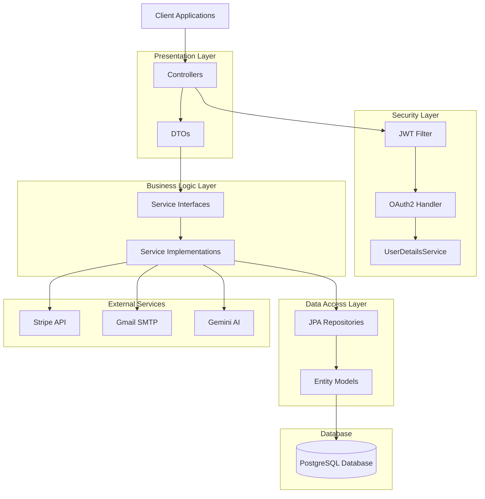
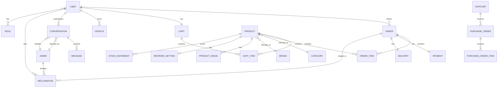

# Backend Documentation - Car E-Commerce Platform

## Table of Contents
1. [Overview](#overview)
2. [Technology Stack](#technology-stack)
3. [Architecture](#architecture)
4. [Project Structure](#project-structure)
5. [Core Components](#core-components)
6. [Security Implementation](#security-implementation)
7. [Database Schema](#database-schema)
8. [API Endpoints](#api-endpoints)
9. [Configuration](#configuration)
10. [Key Features](#key-features)
11. [Setup and Deployment](#setup-and-deployment)

---

## Overview

This is a comprehensive **Spring Boot** backend application for a **Car E-Commerce Platform** specializing in spare parts. The system provides a complete solution for managing products, orders, payments, inventory, deliveries, customer support, and analytics.

### Main Functionalities
- **User Management**: Registration, authentication (JWT + OAuth2), email verification, password reset
- **Product Management**: CRUD operations for products, categories, brands, and images
- **Shopping Cart**: Add/remove items, update quantities, calculate totals
- **Order Processing**: Order creation, status tracking, order history
- **Payment Integration**: Stripe payment processing with webhooks
- **Inventory Management**: Stock tracking, reorder settings, purchase orders, suppliers
- **Delivery System**: Delivery tracking and management
- **Customer Support**: Chat system, reclamations (complaints), AI-powered mechanic assistant
- **Analytics**: Sales reports, revenue tracking, product performance
- **Admin Panel**: User management, product management, order management, analytics dashboard

---

## Technology Stack

### Core Framework
- **Spring Boot 3.5.6** - Main application framework
- **Java 21** - Programming language
- **Maven** - Dependency management and build tool

### Database
- **PostgreSQL** - Relational database
- **Spring Data JPA** - ORM and data access layer
- **Hibernate** - JPA implementation

### Security
- **Spring Security** - Authentication and authorization
- **JWT (JSON Web Tokens)** - Stateless authentication
- **OAuth2** - Google authentication integration
- **BCrypt** - Password encryption

### Additional Libraries
- **Lombok** - Reduce boilerplate code
- **Jackson** - JSON processing
- **SpringDoc OpenAPI (Swagger)** - API documentation
- **Spring Boot Actuator** - Health monitoring
- **Stripe Java SDK** - Payment processing
- **Spring Mail** - Email functionality
- **Spring WebSocket** - Real-time chat functionality
- **Spring Validation** - Input validation

---

## Architecture

The backend follows a **layered architecture** pattern with clear separation of concerns:



### Layer Responsibilities

1. **Controllers (Presentation Layer)**
   - Handle HTTP requests and responses
   - Input validation
   - Route mapping
   - Convert between DTOs and entities

2. **Security Layer**
   - JWT token generation and validation
   - OAuth2 authentication
   - User authentication and authorization
   - Role-based access control

3. **Services (Business Logic Layer)**
   - Implement business rules
   - Transaction management
   - Data transformation
   - Integration with external services

4. **Repositories (Data Access Layer)**
   - Database operations (CRUD)
   - Custom queries
   - Data persistence

5. **Entities (Domain Models)**
   - Database table mappings
   - Relationships between entities
   - Data validation rules

---

## Project Structure

```
Backend/
├── src/
│   ├── main/
│   │   ├── java/com/example/Backend/
│   │   │   ├── BackendApplication.java          # Main application entry point
│   │   │   ├── config/                           # Configuration classes
│   │   │   │   ├── JacksonConfig.java           # JSON serialization config
│   │   │   │   ├── PasswordEncoderConfig.java   # Password encoding config
│   │   │   │   ├── SecurityConfig.java          # Security configuration
│   │   │   │   ├── StripeConfig.java            # Stripe payment config
│   │   │   │   ├── SwaggerConfig.java           # API documentation config
│   │   │   │   └── WebConfig.java               # CORS and web config
│   │   │   ├── controller/                       # REST API controllers
│   │   │   │   ├── AdminController.java
│   │   │   │   ├── AnalyticsController.java
│   │   │   │   ├── AuthController.java
│   │   │   │   ├── BrandController.java
│   │   │   │   ├── CartController.java
│   │   │   │   ├── CategoryController.java
│   │   │   │   ├── ChatController.java
│   │   │   │   ├── DeliveryController.java
│   │   │   │   ├── IAController.java
│   │   │   │   ├── InventoryController.java
│   │   │   │   ├── OrderController.java
│   │   │   │   ├── PaymentController.java
│   │   │   │   ├── ProductController.java
│   │   │   │   ├── ReclamationController.java
│   │   │   │   ├── ReportController.java
│   │   │   │   ├── SuperAdminController.java
│   │   │   │   ├── UserController.java
│   │   │   │   └── VehicleController.java
│   │   │   ├── dto/                              # Data Transfer Objects
│   │   │   │   ├── AdminDTO.java
│   │   │   │   ├── AnalyticsDTO.java
│   │   │   │   ├── CartItemDTO.java
│   │   │   │   ├── LoginDTO.java
│   │   │   │   ├── LoginResponse.java
│   │   │   │   ├── OrderDTO.java
│   │   │   │   ├── PaymentDTO.java
│   │   │   │   ├── ProductDTO.java
│   │   │   │   ├── RegisterDTO.java
│   │   │   │   └── ... (27 DTOs total)
│   │   │   ├── entity/                           # JPA Entities
│   │   │   │   ├── Admin.java
│   │   │   │   ├── Brand.java
│   │   │   │   ├── Cart.java
│   │   │   │   ├── CartItem.java
│   │   │   │   ├── Category.java
│   │   │   │   ├── Conversation.java
│   │   │   │   ├── Delivery.java
│   │   │   │   ├── Message.java
│   │   │   │   ├── Order.java
│   │   │   │   ├── OrderItem.java
│   │   │   │   ├── Payment.java
│   │   │   │   ├── Product.java
│   │   │   │   ├── ProductImage.java
│   │   │   │   ├── PurchaseOrder.java
│   │   │   │   ├── Reclamation.java
│   │   │   │   ├── Recommendation.java
│   │   │   │   ├── ReorderSetting.java
│   │   │   │   ├── Report.java
│   │   │   │   ├── Role.java
│   │   │   │   ├── StockMovement.java
│   │   │   │   ├── Supplier.java
│   │   │   │   ├── User.java
│   │   │   │   └── Vehicle.java
│   │   │   ├── exception/                        # Custom exceptions
│   │   │   │   ├── EmailAlreadyExistsException.java
│   │   │   │   ├── ResourceNotFoundException.java
│   │   │   │   └── UnauthorizedException.java
│   │   │   ├── repository/                       # Data access layer
│   │   │   │   ├── BrandRepository.java
│   │   │   │   ├── CartRepository.java
│   │   │   │   ├── CategoryRepository.java
│   │   │   │   ├── OrderRepository.java
│   │   │   │   ├── ProductRepository.java
│   │   │   │   ├── UserRepository.java
│   │   │   │   └── ... (23 repositories total)
│   │   │   ├── security/                         # Security components
│   │   │   │   ├── CustomOAuth2UserService.java
│   │   │   │   ├── CustomUserDetailsService.java
│   │   │   │   ├── JwtAuthenticationFilter.java
│   │   │   │   ├── JwtTokenProvider.java
│   │   │   │   ├── OAuth2AuthenticationSuccessHandler.java
│   │   │   │   ├── SecurityConstants.java
│   │   │   │   └── UserPrincipal.java
│   │   │   ├── service/                          # Service interfaces
│   │   │   │   ├── AdminService.java
│   │   │   │   ├── AnalyticsService.java
│   │   │   │   ├── AuthService.java
│   │   │   │   ├── CartService.java
│   │   │   │   ├── EmailService.java
│   │   │   │   ├── OrderService.java
│   │   │   │   ├── PaymentService.java
│   │   │   │   ├── ProductService.java
│   │   │   │   └── ... (24 services total)
│   │   │   │   └── impl/                         # Service implementations
│   │   │   │       ├── AdminServiceImpl.java
│   │   │   │       ├── AnalyticsServiceImpl.java
│   │   │   │       ├── AuthServiceImpl.java
│   │   │   │       ├── CartServiceImpl.java
│   │   │   │       ├── OrderServiceImpl.java
│   │   │   │       ├── PaymentServiceImpl.java
│   │   │   │       └── ... (21 implementations)
│   │   │   └── util/                             # Utility classes
│   │   │       ├── EmailTemplates.java
│   │   │       └── FileUploadUtil.java
│   │   └── resources/
│   │       ├── application.properties            # Application configuration
│   │       └── data.sql                          # Initial data (if any)
│   └── test/                                     # Test classes
├── pom.xml                                       # Maven dependencies
└── README.md                                     # Project documentation
```

---

## Core Components

### 1. Configuration (`config/`)

#### SecurityConfig.java
**Purpose**: Configures Spring Security for the application.

**Key Features**:
- Configures JWT authentication filter
- Sets up OAuth2 login with Google
- Defines public and protected endpoints
- Configures CORS settings
- Disables CSRF for stateless API
- Sets up password encoder

**Important Endpoints**:
- **Public**: `/api/auth/**`, `/api/products/**`, `/api/categories/**`, `/api/brands/**`
- **Protected**: All other endpoints require authentication
- **Admin Only**: `/api/admin/**`, `/api/analytics/**`

```java
// Key security configuration
- JWT-based authentication for API endpoints
- OAuth2 integration for Google login
- Role-based access control (USER, ADMIN, SUPER_ADMIN)
- Stateless session management
```

#### WebConfig.java
**Purpose**: Configures CORS (Cross-Origin Resource Sharing) to allow frontend access.

**Configuration**:
- Allows requests from `http://localhost:4200` (Angular frontend)
- Permits all HTTP methods (GET, POST, PUT, DELETE, etc.)
- Allows credentials (cookies, authorization headers)
- Exposes necessary headers

#### StripeConfig.java
**Purpose**: Initializes Stripe API with secret key for payment processing.

#### SwaggerConfig.java
**Purpose**: Configures Swagger/OpenAPI for API documentation.
- Accessible at: `http://localhost:8080/swagger-ui.html`

---

### 2. Security (`security/`)

#### JwtTokenProvider.java
**Purpose**: Handles JWT token generation, validation, and parsing.

**Key Methods**:
- `generateToken(UserPrincipal)`: Creates JWT token with user details
- `validateToken(String)`: Validates token signature and expiration
- `getUserIdFromToken(String)`: Extracts user ID from token
- `getEmailFromToken(String)`: Extracts email from token

**Token Structure**:
```json
{
  "sub": "user@example.com",
  "userId": 123,
  "roles": ["ROLE_USER"],
  "iat": 1234567890,
  "exp": 1234654290
}
```

#### JwtAuthenticationFilter.java
**Purpose**: Intercepts HTTP requests to validate JWT tokens.

**Flow**:
1. Extract JWT token from `Authorization` header
2. Validate token using `JwtTokenProvider`
3. Load user details from database
4. Set authentication in Spring Security context
5. Continue with request processing

#### CustomUserDetailsService.java
**Purpose**: Loads user details from database for Spring Security.

**Implementation**:
- Loads user by email
- Converts `User` entity to `UserPrincipal`
- Used by Spring Security for authentication

#### CustomOAuth2UserService.java
**Purpose**: Handles OAuth2 authentication with Google.

**Flow**:
1. User authenticates with Google
2. Receive user info from Google
3. Check if user exists in database
4. Create new user if not exists
5. Return `UserPrincipal` for authentication

#### OAuth2AuthenticationSuccessHandler.java
**Purpose**: Handles successful OAuth2 authentication.

**Flow**:
1. User successfully authenticates with Google
2. Generate JWT token
3. Redirect to frontend with token as URL parameter
4. Frontend stores token and uses for API requests

---

### 3. Entities (`entity/`)

All entities use JPA annotations for database mapping. Here are the key entities:

#### User.java
**Purpose**: Represents a customer/user in the system.

**Fields**:
- `id` (Long) - Primary key
- `firstName` (String) - User's first name
- `lastName` (String) - User's last name
- `email` (String) - Unique email address
- `password` (String) - Encrypted password
- `phoneNumber` (String) - Contact number
- `address` (String) - Shipping address
- `emailVerified` (Boolean) - Email verification status
- `verificationToken` (String) - Token for email verification
- `resetPasswordToken` (String) - Token for password reset
- `provider` (String) - Authentication provider (LOCAL, GOOGLE)
- `roles` (Set<Role>) - User roles (Many-to-Many)
- `cart` (Cart) - User's shopping cart (One-to-One)
- `orders` (List<Order>) - User's orders (One-to-Many)
- `vehicles` (List<Vehicle>) - User's vehicles (One-to-Many)
- `conversations` (List<Conversation>) - Chat conversations (One-to-Many)
- `reclamations` (List<Reclamation>) - User complaints (One-to-Many)

#### Product.java
**Purpose**: Represents a spare part product.

**Fields**:
- `id` (Long) - Primary key
- `name` (String) - Product name
- `description` (String) - Product description
- `price` (Double) - Product price
- `stockQuantity` (Integer) - Available stock
- `sku` (String) - Stock Keeping Unit (unique identifier)
- `category` (Category) - Product category (Many-to-One)
- `brand` (Brand) - Product brand (Many-to-One)
- `images` (List<ProductImage>) - Product images (One-to-Many)
- `compatibility` (String) - Compatible vehicle models
- `warrantyPeriod` (Integer) - Warranty in months
- `weight` (Double) - Product weight
- `dimensions` (String) - Product dimensions
- `createdAt` (LocalDateTime) - Creation timestamp
- `updatedAt` (LocalDateTime) - Last update timestamp

#### Order.java
**Purpose**: Represents a customer order.

**Fields**:
- `id` (Long) - Primary key
- `orderNumber` (String) - Unique order number
- `user` (User) - Customer who placed order (Many-to-One)
- `orderItems` (List<OrderItem>) - Items in order (One-to-Many)
- `totalAmount` (Double) - Total order amount
- `status` (String) - Order status (PENDING, PROCESSING, SHIPPED, DELIVERED, CANCELLED)
- `shippingAddress` (String) - Delivery address
- `payment` (Payment) - Payment details (One-to-One)
- `delivery` (Delivery) - Delivery details (One-to-One)
- `createdAt` (LocalDateTime) - Order creation time
- `updatedAt` (LocalDateTime) - Last update time

#### Cart.java
**Purpose**: Represents a user's shopping cart.

**Fields**:
- `id` (Long) - Primary key
- `user` (User) - Cart owner (One-to-One)
- `cartItems` (List<CartItem>) - Items in cart (One-to-Many)
- `totalPrice` (Double) - Total cart value
- `createdAt` (LocalDateTime) - Cart creation time
- `updatedAt` (LocalDateTime) - Last update time

#### Payment.java
**Purpose**: Represents a payment transaction.

**Fields**:
- `id` (Long) - Primary key
- `order` (Order) - Associated order (One-to-One)
- `amount` (Double) - Payment amount
- `paymentMethod` (String) - Payment method (CARD, PAYPAL, etc.)
- `paymentStatus` (String) - Status (PENDING, COMPLETED, FAILED)
- `stripePaymentIntentId` (String) - Stripe payment intent ID
- `transactionId` (String) - Transaction reference
- `createdAt` (LocalDateTime) - Payment time

#### Delivery.java
**Purpose**: Represents order delivery information.

**Fields**:
- `id` (Long) - Primary key
- `order` (Order) - Associated order (One-to-One)
- `trackingNumber` (String) - Tracking number
- `carrier` (String) - Delivery carrier
- `status` (String) - Delivery status (PENDING, IN_TRANSIT, DELIVERED)
- `estimatedDeliveryDate` (LocalDate) - Expected delivery date
- `actualDeliveryDate` (LocalDate) - Actual delivery date
- `deliveryAddress` (String) - Delivery address

#### Reclamation.java
**Purpose**: Represents customer complaints/issues.

**Fields**:
- `id` (Long) - Primary key
- `user` (User) - User who filed complaint (Many-to-One)
- `order` (Order) - Related order (Many-to-One)
- `subject` (String) - Complaint subject
- `description` (String) - Detailed description
- `status` (String) - Status (OPEN, IN_PROGRESS, RESOLVED, CLOSED)
- `priority` (String) - Priority level (LOW, MEDIUM, HIGH)
- `createdAt` (LocalDateTime) - Creation time
- `resolvedAt` (LocalDateTime) - Resolution time

#### Category.java
**Purpose**: Product categories (e.g., Engine Parts, Brakes, Filters).

**Fields**:
- `id` (Long) - Primary key
- `name` (String) - Category name
- `description` (String) - Category description
- `products` (List<Product>) - Products in category (One-to-Many)

#### Brand.java
**Purpose**: Product brands (e.g., Bosch, Brembo, Mann-Filter).

**Fields**:
- `id` (Long) - Primary key
- `name` (String) - Brand name
- `description` (String) - Brand description
- `products` (List<Product>) - Products of this brand (One-to-Many)

#### Conversation.java
**Purpose**: Chat conversations between users and support.

**Fields**:
- `id` (Long) - Primary key
- `user` (User) - User in conversation (Many-to-One)
- `admin` (Admin) - Admin handling conversation (Many-to-One)
- `messages` (List<Message>) - Chat messages (One-to-Many)
- `status` (String) - Conversation status (ACTIVE, CLOSED)
- `createdAt` (LocalDateTime) - Start time

#### Message.java
**Purpose**: Individual chat messages.

**Fields**:
- `id` (Long) - Primary key
- `conversation` (Conversation) - Parent conversation (Many-to-One)
- `senderType` (String) - Sender type (USER, ADMIN, SYSTEM)
- `senderId` (Long) - Sender ID
- `content` (String) - Message content
- `timestamp` (LocalDateTime) - Message time
- `read` (Boolean) - Read status

#### PurchaseOrder.java
**Purpose**: Orders placed to suppliers for inventory restocking.

**Fields**:
- `id` (Long) - Primary key
- `orderNumber` (String) - Unique PO number
- `supplier` (Supplier) - Supplier (Many-to-One)
- `items` (List<PurchaseOrderItem>) - Items ordered (One-to-Many)
- `totalAmount` (Double) - Total PO amount
- `status` (String) - Status (PENDING, APPROVED, RECEIVED, CANCELLED)
- `orderDate` (LocalDate) - Order date
- `expectedDeliveryDate` (LocalDate) - Expected delivery
- `actualDeliveryDate` (LocalDate) - Actual delivery

#### Supplier.java
**Purpose**: Suppliers for inventory management.

**Fields**:
- `id` (Long) - Primary key
- `name` (String) - Supplier name
- `contactPerson` (String) - Contact person
- `email` (String) - Contact email
- `phoneNumber` (String) - Contact phone
- `address` (String) - Supplier address
- `products` (List<Product>) - Products supplied (Many-to-Many)

#### StockMovement.java
**Purpose**: Tracks inventory movements (in/out).

**Fields**:
- `id` (Long) - Primary key
- `product` (Product) - Product moved (Many-to-One)
- `movementType` (String) - Type (IN, OUT, ADJUSTMENT)
- `quantity` (Integer) - Quantity moved
- `reason` (String) - Movement reason
- `referenceNumber` (String) - Reference (order/PO number)
- `createdAt` (LocalDateTime) - Movement time

#### ReorderSetting.java
**Purpose**: Automatic reorder settings for products.

**Fields**:
- `id` (Long) - Primary key
- `product` (Product) - Product (One-to-One)
- `reorderPoint` (Integer) - Minimum stock level to trigger reorder
- `reorderQuantity` (Integer) - Quantity to reorder
- `enabled` (Boolean) - Auto-reorder enabled

#### Vehicle.java
**Purpose**: User's vehicles for compatibility checking.

**Fields**:
- `id` (Long) - Primary key
- `user` (User) - Vehicle owner (Many-to-One)
- `make` (String) - Vehicle make (e.g., Toyota)
- `model` (String) - Vehicle model (e.g., Corolla)
- `year` (Integer) - Manufacturing year
- `vin` (String) - Vehicle Identification Number

---

### 4. Repositories (`repository/`)

All repositories extend `JpaRepository` which provides:
- Basic CRUD operations
- Pagination and sorting
- Query methods by convention

#### Key Repositories:

**UserRepository.java**
```java
- findByEmail(String email): Find user by email
- existsByEmail(String email): Check if email exists
- findByVerificationToken(String token): Find user by verification token
- findByResetPasswordToken(String token): Find user by reset token
```

**ProductRepository.java**
```java
- findByCategory(Category category): Find products by category
- findByBrand(Brand brand): Find products by brand
- findByNameContainingIgnoreCase(String name): Search products by name
- findByStockQuantityLessThan(Integer quantity): Find low stock products
- findBySku(String sku): Find product by SKU
```

**OrderRepository.java**
```java
- findByUser(User user): Find orders by user
- findByOrderNumber(String orderNumber): Find order by order number
- findByStatus(String status): Find orders by status
- findByUserAndStatus(User user, String status): Find user orders by status
- calculateTotalRevenue(): Custom query for total revenue
- findTopSellingProducts(): Custom query for analytics
```

**CartRepository.java**
```java
- findByUser(User user): Find cart by user
- deleteByUser(User user): Delete user's cart
```

**PaymentRepository.java**
```java
- findByOrder(Order order): Find payment by order
- findByStripePaymentIntentId(String intentId): Find payment by Stripe intent
```

**ReclamationRepository.java**
```java
- findByUser(User user): Find reclamations by user
- findByStatus(String status): Find reclamations by status
- findByPriority(String priority): Find reclamations by priority
```

**ConversationRepository.java**
```java
- findByUser(User user): Find conversations by user
- findByAdmin(Admin admin): Find conversations by admin
- findByStatus(String status): Find conversations by status
```

---

### 5. Services (`service/` and `service/impl/`)

Services contain business logic. Each service has an interface and implementation.

#### AuthService / AuthServiceImpl
**Purpose**: Currently empty - Authentication is handled by Spring Security's `AuthenticationManager`.

**Why it's empty:**
- Spring Security provides built-in authentication via `AuthenticationManager` (configured in `SecurityConfig.java`)
- `CustomUserDetailsService` loads users from the database
- `PasswordEncoder` handles password comparison
- `JwtTokenProvider` generates JWT tokens
- `UserService` handles user-related operations (registration, email verification, password reset)

**Authentication Flow:**
1. User sends credentials to `AuthController`
2. `AuthController` uses `AuthenticationManager.authenticate()`
3. Spring Security calls `CustomUserDetailsService.loadUserByUsername()`
4. User is loaded from database and converted to `UserPrincipal`
5. `PasswordEncoder` compares passwords
6. If successful, `JwtTokenProvider` generates JWT token
7. Token is returned to client

**Note:** This service could be used in the future for custom authentication logic (e.g., 2FA, phone login), but currently all authentication is handled by Spring Security's standard mechanisms.

For detailed explanation, see `AUTHENTICATION_FLOW_EXPLAINED.md`

#### ProductService / ProductServiceImpl
**Purpose**: Manages products.

**Key Methods**:
- `getAllProducts()`: Get all products
- `getProductById(Long id)`: Get product by ID
- `createProduct(ProductDTO)`: Create new product
- `updateProduct(Long id, ProductDTO)`: Update product
- `deleteProduct(Long id)`: Delete product
- `searchProducts(String keyword)`: Search products
- `getProductsByCategory(Long categoryId)`: Filter by category
- `getProductsByBrand(Long brandId)`: Filter by brand
- `getLowStockProducts()`: Get products below reorder point
- `updateStock(Long id, Integer quantity)`: Update stock quantity

#### CartService / CartServiceImpl
**Purpose**: Manages shopping cart.

**Key Methods**:
- `getCart(Long userId)`: Get user's cart
- `addToCart(Long userId, Long productId, Integer quantity)`: Add item to cart
  - Validates product availability
  - Checks stock quantity
  - Updates cart total

- `updateCartItem(Long userId, Long cartItemId, Integer quantity)`: Update item quantity
- `removeFromCart(Long userId, Long cartItemId)`: Remove item from cart
- `clearCart(Long userId)`: Empty cart
- `calculateCartTotal(Long userId)`: Calculate total price

#### OrderService / OrderServiceImpl
**Purpose**: Manages orders.

**Key Methods**:
- `createOrder(Long userId, OrderDTO)`: Create new order
  - Validates cart items
  - Checks stock availability
  - Creates order items
  - Updates product stock
  - Clears cart
  - Initiates payment

- `getOrderById(Long id)`: Get order details
- `getUserOrders(Long userId)`: Get user's order history
- `updateOrderStatus(Long id, String status)`: Update order status
- `cancelOrder(Long id)`: Cancel order
  - Validates cancellation eligibility
  - Restores product stock
  - Processes refund

#### PaymentService / PaymentServiceImpl
**Purpose**: Handles payment processing with Stripe.

**Key Methods**:
- `createPaymentIntent(PaymentIntentRequest)`: Create Stripe payment intent
  - Calculates amount
  - Creates Stripe payment intent
  - Returns client secret for frontend

- `confirmPayment(String paymentIntentId)`: Confirm payment
  - Validates payment with Stripe
  - Updates payment status
  - Updates order status

- `processRefund(Long paymentId)`: Process refund
  - Creates Stripe refund
  - Updates payment status

#### EmailService
**Purpose**: Sends emails for various events.

**Key Methods**:
- `sendVerificationEmail(String email, String token)`: Send email verification
- `sendPasswordResetEmail(String email, String token)`: Send password reset
- `sendOrderConfirmation(Order order)`: Send order confirmation
- `sendOrderStatusUpdate(Order order)`: Send order status update
- `sendWelcomeEmail(String email, String name)`: Send welcome email

**Email Templates**:
- Uses HTML templates with styling
- Includes dynamic content (user name, order details, links)
- Branded with company logo and colors

#### AnalyticsService / AnalyticsServiceImpl
**Purpose**: Provides business analytics and reports.

**Key Methods**:
- `getTotalRevenue()`: Calculate total revenue
- `getTotalOrders()`: Count total orders
- `getTotalUsers()`: Count total users
- `getRevenueByPeriod(LocalDate start, LocalDate end)`: Revenue for date range
- `getTopSellingProducts(Integer limit)`: Get best-selling products
- `getOrdersByStatus()`: Count orders by status
- `getSalesTrend()`: Get sales trend data
- `getCustomerGrowth()`: Get user registration trend

#### DeliveryService / DeliveryServiceImpl
**Purpose**: Manages order deliveries.

**Key Methods**:
- `createDelivery(Long orderId, DeliveryDTO)`: Create delivery
- `updateDeliveryStatus(Long id, String status)`: Update delivery status
- `trackDelivery(String trackingNumber)`: Track delivery
- `getDeliveriesByStatus(String status)`: Get deliveries by status
- `updateTrackingNumber(Long id, String trackingNumber)`: Update tracking

#### ReclamationService / ReclamationServiceImpl
**Purpose**: Manages customer complaints.

**Key Methods**:
- `createReclamation(Long userId, ReclamationDTO)`: Create complaint
- `getReclamationById(Long id)`: Get complaint details
- `getUserReclamations(Long userId)`: Get user's complaints
- `updateReclamationStatus(Long id, String status)`: Update status
- `assignReclamation(Long id, Long adminId)`: Assign to admin
- `resolveReclamation(Long id, String resolution)`: Resolve complaint

#### ChatService / ChatServiceImpl
**Purpose**: Manages real-time chat.

**Key Methods**:
- `createConversation(Long userId)`: Start new conversation
- `sendMessage(Long conversationId, MessageDTO)`: Send message
- `getConversationMessages(Long conversationId)`: Get chat history
- `markMessageAsRead(Long messageId)`: Mark message as read
- `closeConversation(Long conversationId)`: Close conversation

#### IAService (AI Service)
**Purpose**: Integrates with Gemini AI for mechanic assistant.

**Key Methods**:
- `getRecommendation(String query, Long vehicleId)`: Get AI recommendations
  - Analyzes user query
  - Considers vehicle compatibility
  - Suggests relevant products
  - Provides technical advice

#### InventoryController / InventoryService
**Purpose**: Manages inventory operations.

**Key Methods**:
- `getStockMovements()`: Get stock movement history
- `createStockMovement(StockMovementDTO)`: Record stock movement
- `createPurchaseOrder(PurchaseOrderDTO)`: Create purchase order
- `receivePurchaseOrder(Long id)`: Receive PO and update stock
- `getReorderSettings()`: Get auto-reorder settings
- `updateReorderSetting(Long productId, ReorderSettingDTO)`: Update settings
- `checkReorderPoints()`: Check products needing reorder

---

### 6. Controllers (`controller/`)

Controllers handle HTTP requests and map them to service methods.

#### AuthController
**Endpoints**:
- `POST /api/auth/register` - Register new user
- `POST /api/auth/login` - Login user
- `GET /api/auth/verify-email?token={token}` - Verify email
- `POST /api/auth/forgot-password` - Request password reset
- `POST /api/auth/reset-password` - Reset password
- `POST /api/auth/resend-verification` - Resend verification email

#### ProductController
**Endpoints**:
- `GET /api/products` - Get all products (public)
- `GET /api/products/{id}` - Get product by ID (public)
- `POST /api/products` - Create product (admin only)
- `PUT /api/products/{id}` - Update product (admin only)
- `DELETE /api/products/{id}` - Delete product (admin only)
- `GET /api/products/search?keyword={keyword}` - Search products
- `GET /api/products/category/{categoryId}` - Filter by category
- `GET /api/products/brand/{brandId}` - Filter by brand
- `GET /api/products/low-stock` - Get low stock products (admin)

#### CartController
**Endpoints**:
- `GET /api/cart` - Get user's cart
- `POST /api/cart/add` - Add item to cart
- `PUT /api/cart/items/{itemId}` - Update cart item
- `DELETE /api/cart/items/{itemId}` - Remove cart item
- `DELETE /api/cart/clear` - Clear cart

#### OrderController
**Endpoints**:
- `POST /api/orders` - Create order
- `GET /api/orders` - Get user's orders
- `GET /api/orders/{id}` - Get order details
- `PUT /api/orders/{id}/status` - Update order status (admin)
- `DELETE /api/orders/{id}` - Cancel order

#### PaymentController
**Endpoints**:
- `POST /api/payments/create-intent` - Create payment intent
- `POST /api/payments/confirm` - Confirm payment
- `POST /api/payments/webhook` - Stripe webhook handler

#### CategoryController
**Endpoints**:
- `GET /api/categories` - Get all categories (public)
- `GET /api/categories/{id}` - Get category by ID
- `POST /api/categories` - Create category (admin)
- `PUT /api/categories/{id}` - Update category (admin)
- `DELETE /api/categories/{id}` - Delete category (admin)

#### BrandController
**Endpoints**:
- `GET /api/brands` - Get all brands (public)
- `GET /api/brands/{id}` - Get brand by ID
- `POST /api/brands` - Create brand (admin)
- `PUT /api/brands/{id}` - Update brand (admin)
- `DELETE /api/brands/{id}` - Delete brand (admin)

#### AnalyticsController
**Endpoints**:
- `GET /api/analytics/revenue` - Get total revenue (admin)
- `GET /api/analytics/orders` - Get total orders (admin)
- `GET /api/analytics/users` - Get total users (admin)
- `GET /api/analytics/top-products` - Get top selling products (admin)
- `GET /api/analytics/sales-trend` - Get sales trend (admin)

#### ReclamationController
**Endpoints**:
- `POST /api/reclamations` - Create reclamation
- `GET /api/reclamations` - Get user's reclamations
- `GET /api/reclamations/{id}` - Get reclamation details
- `PUT /api/reclamations/{id}/status` - Update status (admin)

#### ChatController
**Endpoints**:
- `POST /api/chat/conversations` - Start conversation
- `POST /api/chat/messages` - Send message
- `GET /api/chat/conversations/{id}/messages` - Get messages
- `PUT /api/chat/messages/{id}/read` - Mark as read

#### DeliveryController
**Endpoints**:
- `POST /api/deliveries` - Create delivery (admin)
- `GET /api/deliveries/{id}` - Get delivery details
- `PUT /api/deliveries/{id}/status` - Update delivery status (admin)
- `GET /api/deliveries/track/{trackingNumber}` - Track delivery

#### AdminController
**Endpoints**:
- `GET /api/admin/users` - Get all users
- `PUT /api/admin/users/{id}/status` - Update user status
- `GET /api/admin/orders` - Get all orders
- `GET /api/admin/reclamations` - Get all reclamations

#### IAController (AI Mechanic)
**Endpoints**:
- `POST /api/ia/recommend` - Get AI recommendations
- `POST /api/ia/diagnose` - Get AI diagnosis

---

## Security Implementation

### Authentication Flow

#### 1. Registration Flow
```
User → POST /api/auth/register
  ↓
AuthController.register()
  ↓
AuthService.register()
  ↓
- Validate email uniqueness
- Hash password with BCrypt
- Create User entity
- Generate verification token
- Save to database
- Send verification email
- Generate JWT token
  ↓
Return: { token, user details }
```

#### 2. Login Flow
```
User → POST /api/auth/login
  ↓
AuthController.login()
  ↓
AuthService.login()
  ↓
- Load user by email
- Verify password with BCrypt
- Check email verification
- Generate JWT token
  ↓
Return: { token, user details }
```

#### 3. OAuth2 Google Login Flow
```
User → Click "Login with Google"
  ↓
Redirect to Google OAuth2
  ↓
User authenticates with Google
  ↓
Google redirects to: /login/oauth2/code/google
  ↓
CustomOAuth2UserService.loadUser()
  ↓
- Get user info from Google
- Check if user exists
- Create user if not exists
- Mark email as verified
  ↓
OAuth2AuthenticationSuccessHandler
  ↓
- Generate JWT token
- Redirect to frontend with token
  ↓
Frontend: http://localhost:4200/auth/callback?token={jwt}
```

#### 4. Protected Endpoint Access
```
User → GET /api/orders (with Authorization header)
  ↓
JwtAuthenticationFilter
  ↓
- Extract token from header
- Validate token
- Get user ID from token
- Load user from database
- Set authentication in SecurityContext
  ↓
OrderController.getUserOrders()
  ↓
- Access authenticated user
- Return user's orders
```

### Role-Based Access Control

**Roles**:
1. **ROLE_USER** - Regular customers
   - Can browse products
   - Can manage cart
   - Can place orders
   - Can view own orders
   - Can create reclamations
   - Can chat with support

2. **ROLE_ADMIN** - Administrators
   - All USER permissions
   - Can manage products
   - Can manage categories/brands
   - Can view all orders
   - Can update order status
   - Can manage deliveries
   - Can view analytics
   - Can handle reclamations

3. **ROLE_SUPER_ADMIN** - Super Administrators
   - All ADMIN permissions
   - Can manage admin accounts
   - Can access system settings
   - Can view all analytics

### Password Security
- Passwords hashed using **BCrypt** (strength: 10)
- Never stored in plain text
- Password reset uses secure tokens
- Tokens expire after use

### Token Security
- JWT tokens signed with secret key
- Tokens expire after 24 hours (configurable)
- Tokens include user ID and roles
- Stateless authentication (no server-side sessions)

---

## Database Schema

### Entity Relationships



### Key Tables

**users**
- Primary key: `id`
- Unique: `email`
- Indexes: `email`, `verification_token`, `reset_password_token`

**products**
- Primary key: `id`
- Unique: `sku`
- Foreign keys: `category_id`, `brand_id`
- Indexes: `category_id`, `brand_id`, `name`

**orders**
- Primary key: `id`
- Unique: `order_number`
- Foreign key: `user_id`
- Indexes: `user_id`, `status`, `order_number`

**payments**
- Primary key: `id`
- Foreign key: `order_id`
- Unique: `stripe_payment_intent_id`
- Indexes: `order_id`, `stripe_payment_intent_id`

---

## Configuration

### Application Properties

Located in: `src/main/resources/application.properties`

#### Database Configuration
```properties
spring.datasource.url=jdbc:postgresql://localhost:5432/ecommercespareparts
spring.datasource.username=postgres
spring.datasource.password=lasmer
spring.jpa.hibernate.ddl-auto=update
```

#### JWT Configuration
```properties
jwt.secret=mySecretKeyForJWTTokenGenerationAndValidation1234567890
jwt.expiration=86400000  # 24 hours in milliseconds
```

#### Email Configuration
```properties
spring.mail.host=smtp.gmail.com
spring.mail.port=587
spring.mail.username=ahmedbessrour81@gmail.com
spring.mail.password=lrur pwud gjpi zsnt  # App password
```

#### Stripe Configuration
```properties
stripe.api.key=sk_test_51RKrWfR4VUC3K771...
stripe.webhook.secret=whsec_YOUR_WEBHOOK_SECRET_HERE
```

#### OAuth2 Google Configuration
```properties
spring.security.oauth2.client.registration.google.client-id=997621621962-2lr4h9riu1qte8iq8afldtivcm3dgkqe.apps.googleusercontent.com
spring.security.oauth2.client.registration.google.client-secret=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
```

#### Frontend URL
```properties
app.frontend.url=http://localhost:4200
```

---

## Key Features

### 1. Email Verification
- New users receive verification email
- Email contains verification link
- Users must verify before full access
- Can resend verification email

### 2. Password Reset
- Users can request password reset
- Reset link sent to email
- Token expires after use
- Secure token generation

### 3. Shopping Cart
- Add/remove products
- Update quantities
- Real-time total calculation
- Persistent cart (saved in database)

### 4. Order Processing
- Create order from cart
- Stock validation
- Automatic stock deduction
- Order confirmation email
- Order status tracking

### 5. Payment Integration
- Stripe payment processing
- Secure payment intents
- Webhook handling
- Refund support

### 6. Inventory Management
- Stock tracking
- Low stock alerts
- Automatic reorder points
- Purchase order management
- Stock movement history

### 7. Analytics Dashboard
- Total revenue
- Order statistics
- Top-selling products
- Sales trends
- Customer growth

### 8. Customer Support
- Real-time chat
- Reclamation system
- AI-powered mechanic assistant
- Email notifications

### 9. Delivery Tracking
- Tracking numbers
- Status updates
- Estimated delivery dates
- Carrier information

### 10. Multi-role System
- User role management
- Admin panel
- Super admin controls
- Role-based permissions

---

## Setup and Deployment

### Prerequisites
- Java 21
- Maven 3.6+
- PostgreSQL 12+
- Stripe account (for payments)
- Google Cloud account (for OAuth2)
- Gmail account (for emails)

### Database Setup
1. Install PostgreSQL
2. Create database:
```sql
CREATE DATABASE ecommercespareparts;
```
3. Update `application.properties` with credentials

### Configuration Steps

1. **Clone Repository**
```bash
git clone <repository-url>
cd Backend
```

2. **Configure Database**
- Update `spring.datasource.url`
- Update `spring.datasource.username`
- Update `spring.datasource.password`

3. **Configure JWT**
- Generate secure secret key
- Update `jwt.secret`
- Adjust `jwt.expiration` if needed

4. **Configure Email**
- Create Gmail App Password
- Update `spring.mail.username`
- Update `spring.mail.password`

5. **Configure Stripe**
- Get API keys from Stripe Dashboard
- Update `stripe.api.key`
- Update `stripe.webhook.secret`

6. **Configure Google OAuth2**
- Create OAuth2 credentials in Google Cloud Console
- Update `client-id`
- Update `client-secret`
- Add redirect URI: `http://localhost:8080/login/oauth2/code/google`

7. **Build Project**
```bash
mvn clean install
```

8. **Run Application**
```bash
mvn spring-boot:run
```

Application will start on: `http://localhost:8080`

### API Documentation
Access Swagger UI: `http://localhost:8080/swagger-ui.html`

### Health Check
Access actuator: `http://localhost:8080/actuator/health`

---

## API Testing

### Using Postman

#### 1. Register User
```http
POST http://localhost:8080/api/auth/register
Content-Type: application/json

{
  "firstName": "John",
  "lastName": "Doe",
  "email": "john@example.com",
  "password": "password123",
  "phoneNumber": "1234567890",
  "address": "123 Main St"
}
```

#### 2. Login
```http
POST http://localhost:8080/api/auth/login
Content-Type: application/json

{
  "email": "john@example.com",
  "password": "password123"
}
```

Response:
```json
{
  "token": "eyJhbGciOiJIUzI1NiIsInR5cCI6IkpXVCJ9...",
  "user": {
    "id": 1,
    "email": "john@example.com",
    "firstName": "John",
    "lastName": "Doe"
  }
}
```

#### 3. Get Products (Public)
```http
GET http://localhost:8080/api/products
```

#### 4. Add to Cart (Authenticated)
```http
POST http://localhost:8080/api/cart/add
Authorization: Bearer {token}
Content-Type: application/json

{
  "productId": 1,
  "quantity": 2
}
```

#### 5. Create Order (Authenticated)
```http
POST http://localhost:8080/api/orders
Authorization: Bearer {token}
Content-Type: application/json

{
  "shippingAddress": "123 Main St, City, Country"
}
```

---

## Common Issues and Solutions

### Issue 1: Email Not Sending
**Solution**: 
- Check Gmail App Password
- Enable "Less secure app access" (if using regular password)
- Check firewall settings
- Verify SMTP settings

### Issue 2: JWT Token Invalid
**Solution**:
- Check token expiration
- Verify JWT secret matches
- Ensure token format: `Bearer {token}`
- Check token in Authorization header

### Issue 3: Database Connection Failed
**Solution**:
- Verify PostgreSQL is running
- Check database credentials
- Ensure database exists
- Check port 5432 is open

### Issue 4: Stripe Payment Failed
**Solution**:
- Verify Stripe API key
- Check test mode vs live mode
- Ensure webhook endpoint is accessible
- Verify payment intent amount

### Issue 5: CORS Error
**Solution**:
- Check `WebConfig.java` CORS settings
- Verify frontend URL in allowed origins
- Ensure credentials are allowed
- Check HTTP methods allowed

---

## Best Practices

### Code Organization
- Follow package structure
- Use DTOs for API requests/responses
- Keep controllers thin, services thick
- Use meaningful variable names
- Add comments for complex logic

### Security
- Never commit sensitive data (API keys, passwords)
- Use environment variables for secrets
- Validate all user inputs
- Sanitize data before database operations
- Use HTTPS in production

### Database
- Use indexes for frequently queried fields
- Avoid N+1 query problems
- Use pagination for large datasets
- Regular database backups
- Monitor query performance

### Error Handling
- Use custom exceptions
- Return meaningful error messages
- Log errors for debugging
- Don't expose sensitive information in errors

### Testing
- Write unit tests for services
- Write integration tests for controllers
- Test edge cases
- Test error scenarios
- Maintain test coverage

---

## Conclusion

This backend provides a robust, scalable foundation for a car spare parts e-commerce platform. It implements modern best practices including:

- ✅ Clean architecture with separation of concerns
- ✅ Secure authentication with JWT and OAuth2
- ✅ Role-based access control
- ✅ Payment processing with Stripe
- ✅ Email notifications
- ✅ Real-time chat support
- ✅ AI-powered recommendations
- ✅ Comprehensive inventory management
- ✅ Analytics and reporting
- ✅ RESTful API design
- ✅ API documentation with Swagger

The system is designed to be maintainable, extensible, and production-ready.

---

## Contact and Support

For questions or issues, please contact the development team or refer to:
- API Documentation: `http://localhost:8080/swagger-ui.html`
- Health Status: `http://localhost:8080/actuator/health`

---

**Document Version**: 1.0  
**Last Updated**: November 2024  
**Author**: Backend Development Team
